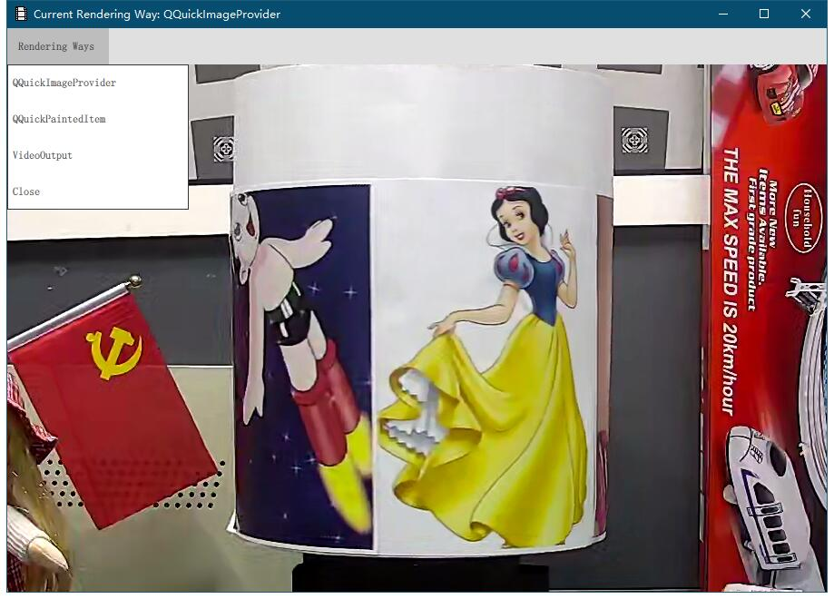

# Just A Demo

The project is a simple demo of that using Qt to rendering ffmpeg-video-frame.

## Rendering Ways

* QQuickPaintedItem
* QQuickImageProvider
* VideoOutput

## Developer Environment

Platform | Qt Version | FFmpeg Version | Compiler
-|-|-|-|
Windows | 5.12 | 4.0.2 | msvc2017/msvc2017_64

## Have A Look

## Note

Ensure that your computer supports the dxva2 decoding
